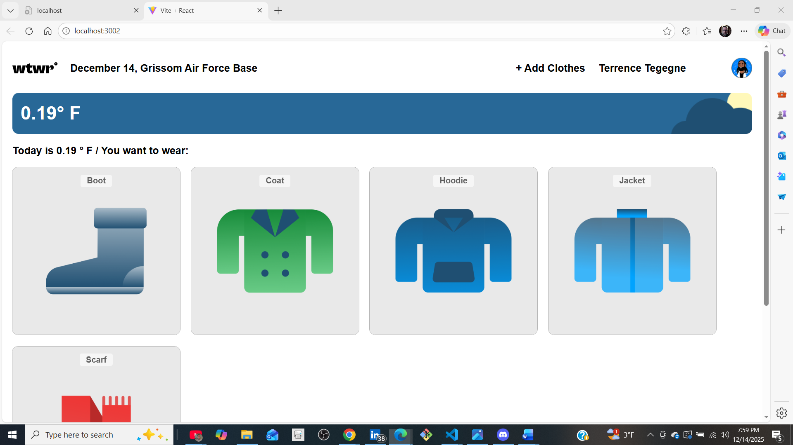
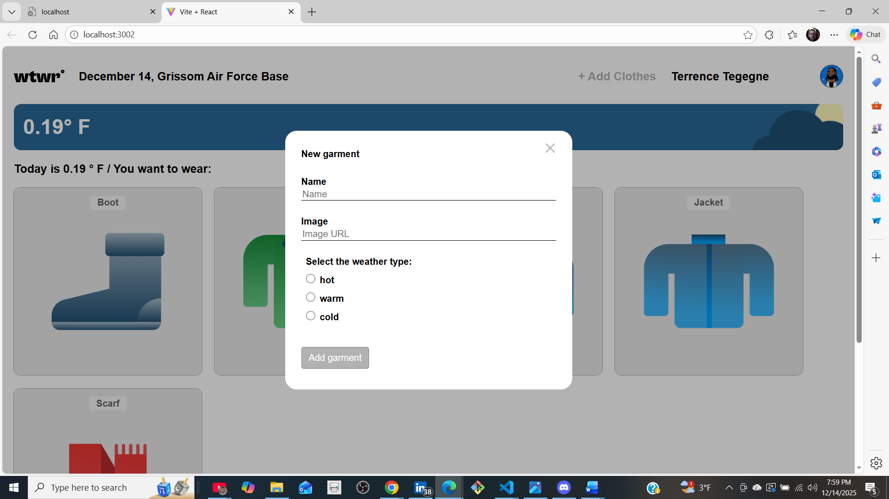
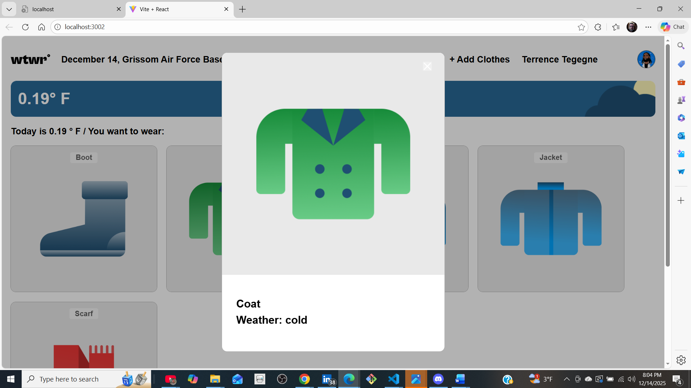

# Project 10: react

WTWR provides clothing recommendations based on current temperature, while the weather card dynamically updates its appearance to reflect real-time weather conditions like [list the conditions you've implemented] and time of day.

### Project 10: description:

"The app recommends clothing based on current temperature ranges, categorizing weather into hot, warm, and cold conditions to filter appropriate clothing items."

**technologies and techniques used**

figma:
Cloud-based design and prototyping tool primarily used for creating user interfaces and user experience for digital products.

.css:
Style sheets is a style sheet language used in web development.

flex box:
help to deploy the elements placement in relationship to the parent and child elements.

transition:
The button required change condition from solid to opaque when hovering. The use of this allows a smoother change to occur.

**JavaScript:**

index.js:
script controling button navigation and modal interface.

Escape Key closure:
script to close modal by pressing the "Escape Key" as if using the close button.

outside modal closure:
script to closing modal only by clicking outside the modal and not the main modal.

submit button lock:
script to lock submit button intil input field meet the criteria to become active.

**React**

React:
eact is a popular JavaScript library for building user interfaces, particularly for single-page applications. It allows developers to create reusable UI components, making the development process more efficient and maintainable.

useState:
The useState hook is a fundamental feature in React that allows you to add state variables to functional components that it provides a way to manage state within functional components without the need for class-based components.

useEfect
The useEffect hook in React is a powerful tool that allows you to perform side effects in your functional components. Side effects are operations that affect something outside the scope of the function being executed, such as fetching data, updating the DOM, or setting up timers.

Api:
In ReactJS, integrating APIs is essential for building dynamic, data-driven applications. APIs allow your frontend to communicate with backend services, fetch data, and perform CRUD operations. You can use Fetch API (built-in) or Axios (third-party) to handle HTTP requests.

children:
Chilren are a special prop automatically passed to every component, representing the content between the opening and closing tags of a component.

**WebPack**

Import images and fonts from Vanilla HTML to have them imported with Webpack.

PostCSS.config.js:
Transpile CSS code to enable the use of the most modern features of their language on older browsers.

Image scr through JavaScript:
Script to guide the image within React.

### Application Navigation Flow

**1. Opening the Add Todo Module**

 
 

**2. Adding Todo Form**

 
 

**3. Adding Date Module**

 
 

# project 10: video

https://1drv.ms/v/c/016b05295161b701/IQDizj-KlHEpQLDyOMQXbpsiAVlFVA5fJ-mGnGx2lmbwf4s?e=0QemDK

**the link to project on GitHub Pages**

Your site is live at https://elmofud.github.io/se_project_react/

# React + Vite

This template provides a minimal setup to get React working in Vite with HMR and some ESLint rules.

Currently, two official plugins are available:

- [@vitejs/plugin-react](https://github.com/vitejs/vite-plugin-react/blob/main/packages/plugin-react/README.md) uses [Babel](https://babeljs.io/) for Fast Refresh
- [@vitejs/plugin-react-swc](https://github.com/vitejs/vite-plugin-react-swc) uses [SWC](https://swc.rs/) for Fast Refresh
