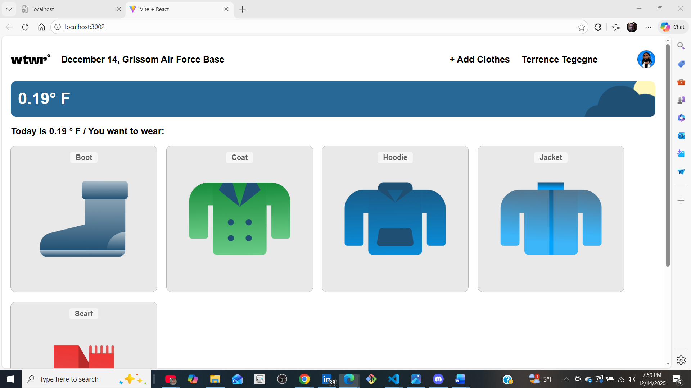
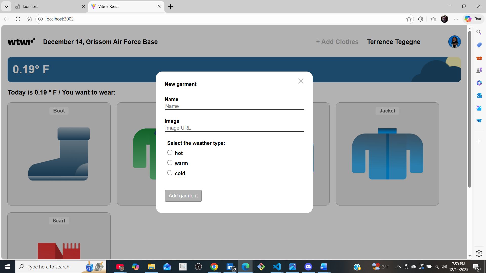
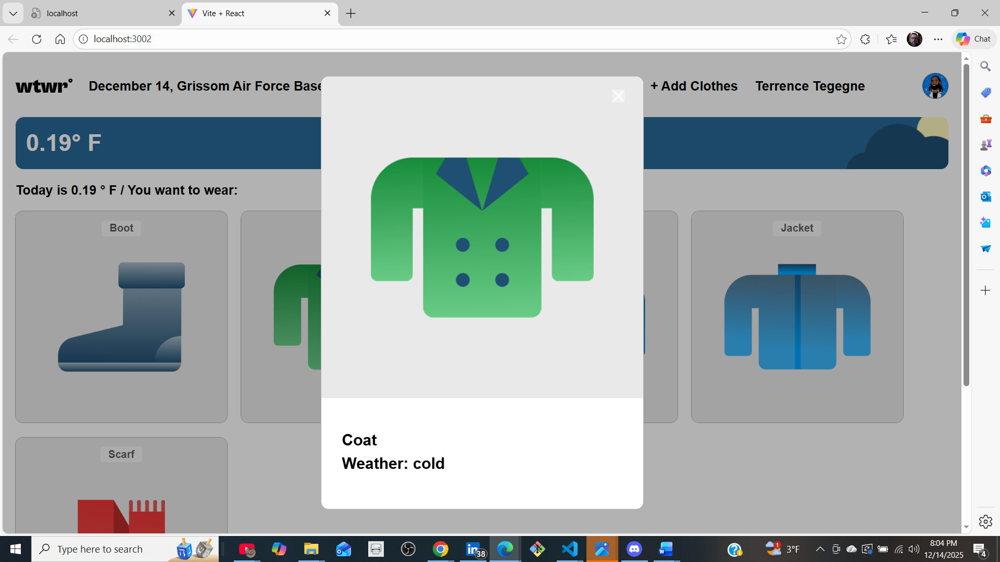
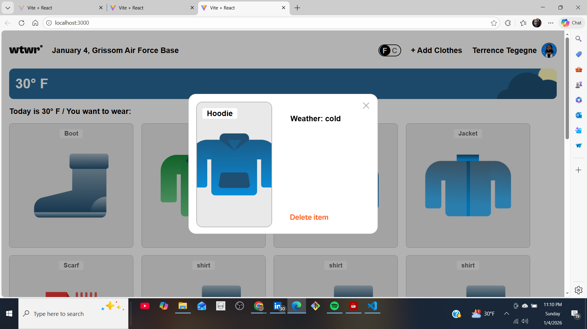
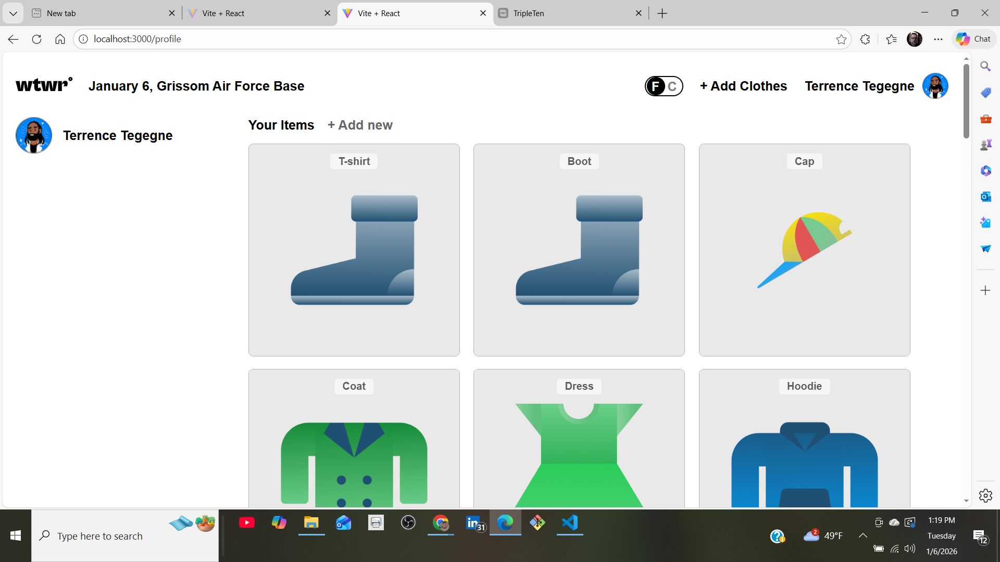
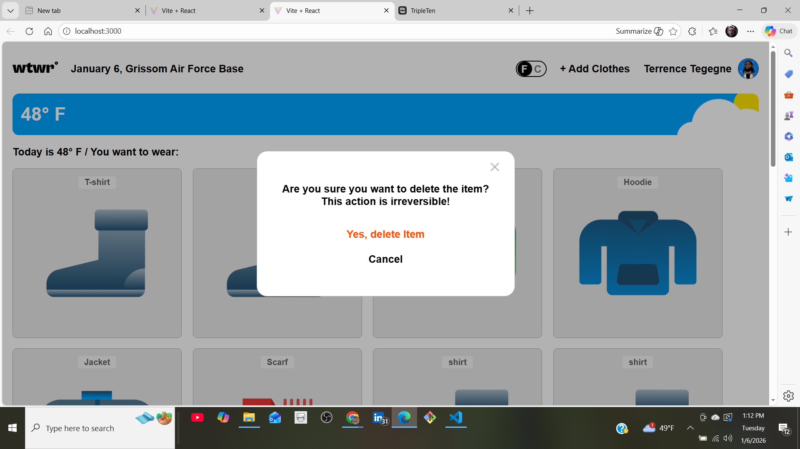

# WTWR (What to Wear)

A React-based weather application that recommends clothing items based on current weather conditions. Users can register, log in, add clothing items, like items, and manage their wardrobe.

## Backend Repository

[WTWR Backend API](https://github.com/elmofud/se_project_express)

## Live Demo

[WTWR on GitHub Pages](https://elmofud.github.io/se_project_react/)

## Features

- **Weather-based recommendations**: Displays clothing items filtered by current weather conditions (hot, warm, cold)
- **User authentication**: Register and log in with secure JWT tokens
- **Profile management**: Update user name and avatar
- **Clothing management**: Add, delete, and like clothing items
- **Responsive design**: Vertical and horizontal layouts for item preview modals
- **Temperature toggle**: Switch between Fahrenheit and Celsius
- **Protected routes**: Profile page accessible only to logged-in users
- **Form validation**: Real-time validation on registration and login forms

## Technologies Used

- **React 18** - UI library with functional components and hooks
- **React Router** - Client-side routing with protected routes
- **Context API** - State management for user and temperature data
- **Vite** - Build tool and development server
- **CSS3** - Styling with BEM methodology
- **REST API** - Communication with Express backend
- **JWT** - Token-based authentication
- **OpenWeather API** - Real-time weather data

## Project Structure

```
src/
├── assets/          # Images and icons
├── components/      # React components
│   ├── AddItemModal/
│   ├── App/
│   ├── ClothesSection/
│   ├── DeleteConfirmationModal/
│   ├── EditProfileModal/
│   ├── Footer/
│   ├── Header/
│   ├── ItemCard/
│   ├── ItemModal/
│   ├── LoginModal/
│   ├── Main/
│   ├── ModalWithForm/
│   ├── Profile/
│   ├── ProtectedRoute/
│   ├── RegisterModal/
│   ├── SideBar/
│   ├── ToggleSwitch/
│   └── WeatherCard/
├── contexts/        # React Context providers
├── Hooks/           # Custom hooks (useForm)
├── utils/           # API and helper functions
│   ├── api.js       # Item CRUD operations
│   ├── auth.js      # Authentication functions
│   ├── constants.js # API keys and coordinates
│   ├── helpers.js   # Utility functions
│   └── weatherApi.js # Weather API integration
└── vendor/          # Third-party CSS (normalize, fonts)
```

## API Endpoints

### Authentication

- `POST /signup` - Register new user
- `POST /signin` - Log in user

### Users

- `GET /users/me` - Get current user
- `PATCH /users/me` - Update user profile

### Items

- `GET /items` - Get all clothing items
- `POST /items` - Add new item (auth required)
- `DELETE /items/:id` - Delete item (auth required)
- `PUT /items/:id/likes` - Like item (auth required)
- `DELETE /items/:id/likes` - Unlike item (auth required)

## Screenshots

### Home Page



### Add Garment Form



### Mobile Preview Modal



### Desktop Preview Modal



### Profile Page



### Delete Confirmation



## Installation

1. Clone the repository:

```bash
git clone https://github.com/elmofud/se_project_react.git
cd se_project_react
```

2. Install dependencies:

```bash
npm install
```

3. Start the development server:

```bash
npm run dev
```

4. Make sure the backend server is running on `http://localhost:3001`

## Scripts

- `npm run dev` - Start development server
- `npm run build` - Build for production
- `npm run preview` - Preview production build

## Video Demos

- [Project 14 Demo](https://www.youtube.com/watch?v=-or2ZmuAKjA)
- [Project 11 Demo](https://1drv.ms/v/c/016b05295161b701/IQCUtMgPl4ynRLvnJY56GBRhAdYAoBF_spa0csYpNdTbFMk?e=gOiwV3)
- [Project 10 Demo](https://1drv.ms/v/c/016b05295161b701/IQDizj-KlHEpQLDyOMQXbpsiAVlFVA5fJ-mGnGx2lmbwf4s?e=0QemDK)

## Author

Developed by Tracey Garber

---

_Built with React + Vite_
